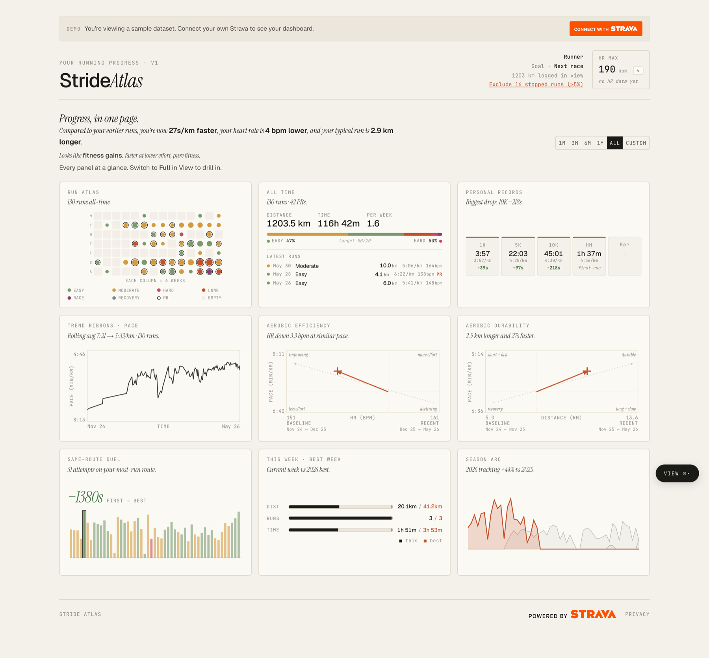
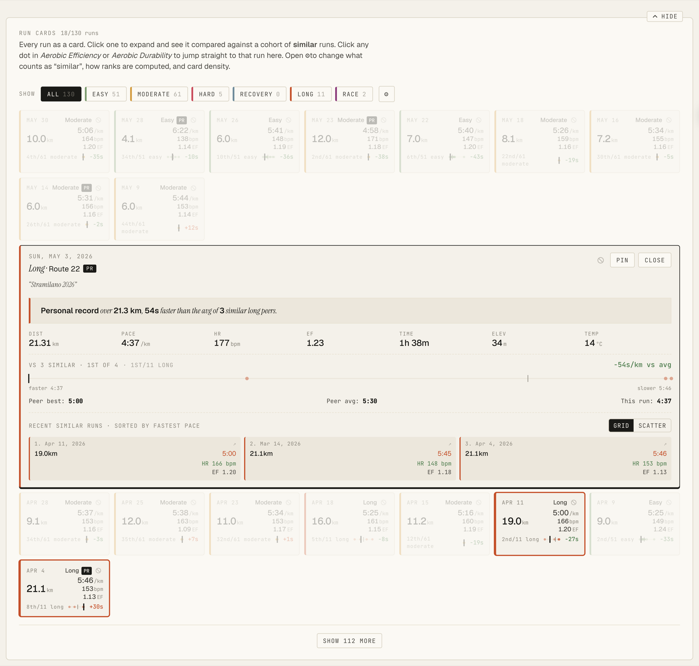
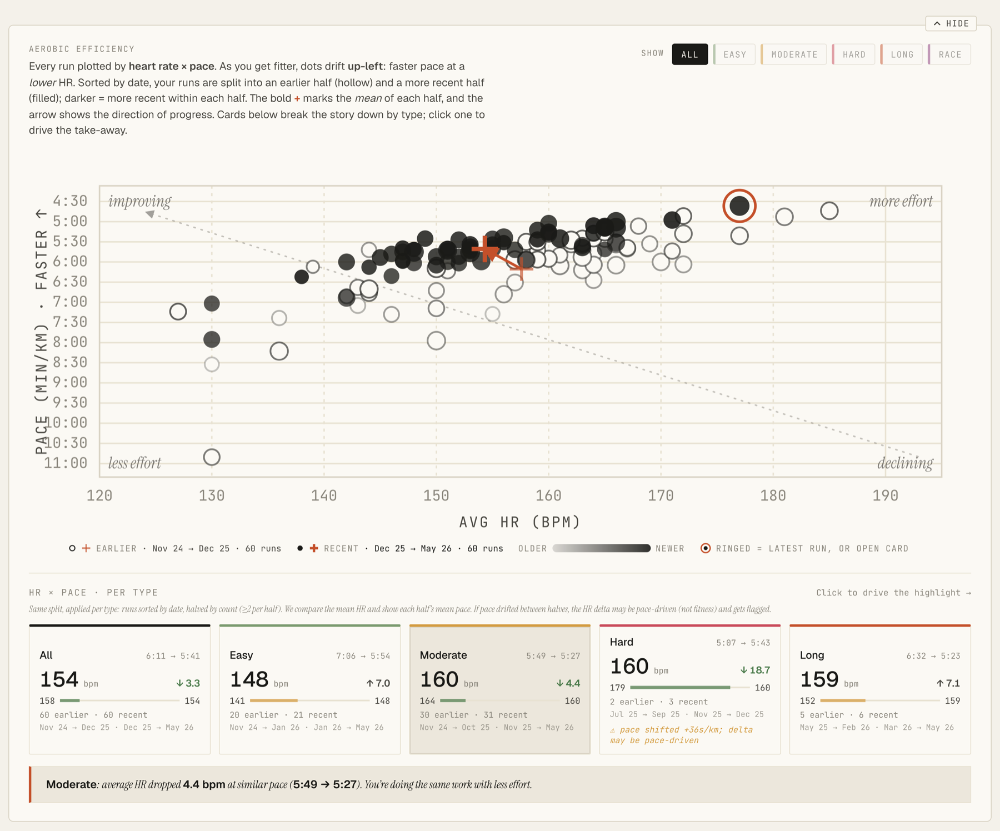
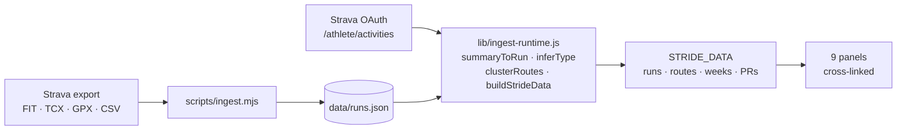

# Stride Atlas

**Connect Strava, get one page that answers the only question that matters: am I actually getting fitter?**

Strava tells you what you did. Stride Atlas tells you whether it's working. It takes your run
history and lays out nine panels that compare you against *you* — every run ranked against
similar runs, heart rate at matched pace over time, each route's first attempt against its
best, this week against your best week.

### [**→ Try the live demo**](https://stride.letizia.tech/demo) (sample data, no login)



<sub><b>Compact view.</b> The whole dashboard on one screen, no scrolling. 130 runs, 1203 km,
an 80/20 intensity split, and a plain-English read at the top: <i>27s/km faster, 4 bpm lower,
2.9 km longer</i>. Switch to <b>Full</b> for the drill-down below.</sub>

<table>
<tr>
<td width="50%" valign="top">

</td>
<td width="50%" valign="top">

</td>
</tr>
<tr>
<td valign="top"><sub><b>Run Cards.</b> Click any run to expand it against a cohort of
<i>similar</i> runs. Here a half marathon at <code>4:37/km</code> lands 54s/km faster than the
average of its three closest peers, with the peer spread drawn as a bar and each comparison run
one click away.</sub></td>
<td valign="top"><sub><b>Aerobic Efficiency.</b> Every run as heart rate × pace. Dots drift
<b>up-left</b> as you get fitter: faster at a lower HR. Hollow = earlier half, filled = recent
half, and the <code>+</code> markers with the arrow show where the average moved. Click a dot to
jump to that run's card.</sub></td>
</tr>
</table>

[](https://nextjs.org)
[](https://react.dev)
[](https://developers.strava.com)
[](https://vercel.com)

---

## The problem it solves

A year of running leaves you with hundreds of activities and no answer. Individual runs are
noisy: you were tired, it was hot, the route had hills. Weekly totals only measure volume, not
fitness. And a PR is a single lucky day, not a trend.

What you actually want is a **like-for-like comparison** — this run against runs of the same
kind and distance, this month's heart rate against last month's at the *same* pace. That's the
whole design brief.

## What each panel answers

| Panel | The question it answers |
|---|---|
| **Run Atlas** | What does a year of training look like? Every run as one calendar cell, sized by distance, colored by intensity. |
| **Run Cards** | Was *this* run good? Each run ranked against a cohort of similar runs, with the peer spread drawn out. |
| **Personal Records** | What are my best rolling splits from 1K to the marathon, and when did they move? |
| **Trend Ribbons** | Is my pace improving *per workout type*? Easy days and hard days get their own trend. |
| **Aerobic Efficiency** | Is my heart rate falling at the same pace? The single clearest fitness signal here. |
| **Aerobic Durability** | Can I hold pace as distance goes up? Distance × pace, with a fit line per type. |
| **Same-Route Duel** | On the route I run most, how does the first attempt compare to the best one? |
| **Week Comparator** | How does this week stack up against my best week, on distance, runs and time? |
| **Season Arc** | Am I ahead of where I was this time last year? |

Click a dot, bar or calendar cell in any panel and the matching run card scrolls into view and
expands. Everything is cross-linked to everything.

## How it works



Two sources, one shape. A Strava login and an offline export of your own files both converge on
the same `STRIDE_DATA` structure, so every panel is written once and works either way.

A few decisions worth knowing about:

- **Intensity is inferred, not tagged.** Each run is classified `easy / moderate / hard / long /
  race / recovery` from heart rate relative to your max, with distance and title as fallbacks.
  Change your HR max in the header and the labels re-shuffle live, no refetch.
- **Routes are clustered from GPS**, not names: runs starting within 500m of each other with
  distances inside 15% are treated as the same route, which is what makes Same-Route Duel work.
- **Peers are matched, not averaged.** A run is only compared against runs of the same type
  within a similar distance band, so an easy 5K is never scored against a long run.
- **Stopped time is handled explicitly.** Runs where a large share of elapsed time was spent
  standing still (red lights, pauses) can be excluded in bulk with a tunable threshold, so city
  running doesn't poison the trends.
- **Units convert at display time.** The data layer is always km, min/km, minutes and meters.
  The km/mi and °C/°F toggles are pure presentation.

## Quick start

```bash
npm install
npm run dev      # http://localhost:3000/demo works immediately, no env vars needed
```

`/demo` renders from the bundled `data/runs.json`, which is enough to develop every panel.

<details>
<summary><b>Use your own Strava export (offline, no API keys)</b></summary>

Request your archive from [Strava → Settings → My Account → Download or Delete Your
Account](https://www.strava.com/athlete/delete_your_account), then:

```bash
# unzip the export into activities/strava/
#   activities.csv + activities/*.fit.gz / *.tcx.gz / *.gpx.gz
npm run ingest   # parses your files → data/runs.json
npm run dev
```

See [`SETUP.md`](./SETUP.md) for the full options: HR max tuning, reverse-geocoded route names,
and manual route renames.

</details>

<details>
<summary><b>Connect live Strava accounts (OAuth)</b></summary>

1. Create an app at [strava.com/settings/api](https://www.strava.com/settings/api) and note the
   Client ID and Client Secret.
2. `cp .env.example .env.local` and fill in `STRAVA_CLIENT_ID`, `STRAVA_CLIENT_SECRET`,
   `STRAVA_REDIRECT_URI`, `SESSION_SECRET` (`openssl rand -hex 32`) and `PUBLIC_APP_URL`.
3. Set the **Authorization Callback Domain** on your Strava app to your host (domain only, no
   protocol or path).
4. `npm run dev`, then click *Connect with Strava*.

Deploying to Vercel is the same list: import the repo, set those five environment variables, add
the production domain to Strava's callback list.

Live mode uses Strava's activity *summaries* only (one API call, cached in memory for an hour
per athlete). Personal Records that need per-activity streams are gated off until that data is
fetched, and the panel says so rather than showing wrong numbers.

</details>

## Privacy

No database, and no activity data stored server-side. Strava tokens live in an encrypted,
`httpOnly` iron-session cookie and are refreshed transparently; your runs are fetched, shaped and
cached in memory for an hour, then gone on the next cold start. The full policy is at
[`/privacy`](https://stride.letizia.tech/privacy).

The committed `data/runs.json` used by `/demo` is a real run history with the athlete profile,
route names and GPS coordinates stripped out.

## Project layout

```
app/
  page.jsx                  landing; logged-in users redirect to /app
  app/page.jsx              the real dashboard (session required)
  demo/page.jsx             same dashboard, bundled sample data
  api/auth/strava/          OAuth initiate + callback
  api/runs/                 fetch + transform Strava activities (cached 1h)
  globals.css               theme tokens for all five palettes
components/                 Dashboard + 9 panels (+ compact variants)
lib/
  ingest-runtime.js         pure transforms shared by the API route and the CLI
  shared.jsx                contexts, hooks, formatters
  theme.js                  palettes and per-type colors
  strava.js                 Strava API client
  session.js                iron-session wrapper
scripts/ingest.mjs          offline: FIT/TCX/GPX → data/runs.json
```

Five visual styles ship with it (editorial light and dark, telemetry, fieldbook, dataart) — every
component reads CSS variables, so a palette is a set of tokens, not a rewrite. Style, time range
and units live behind the **View** button in the bottom right.

For an architectural deep-dive, see [`CLAUDE.md`](./CLAUDE.md).

## Credits

Powered by the [Strava API](https://developers.strava.com). Design originated as a handoff from
Claude Design; data pipeline and Strava integration built on top.
